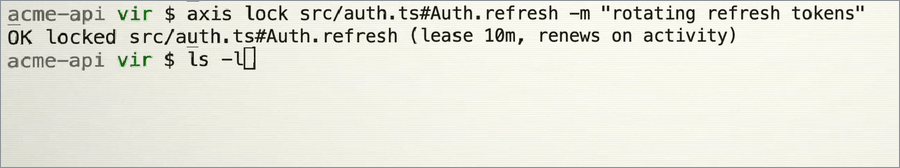

# Axis

**Kernel-enforced, function-level locks for every coding agent on your team.**

Two agents, two laptops, one file: each edits its own function and both changes land. A
third agent that has never heard of Axis tries to touch a locked function, and the
operating system says no.

<!--
  AXIS DEMO. docs/demo.gif and docs/demo-poster.png are cut from docs/axis-demo.mp4
  by docs/make-demo-assets.sh; run it again if the recording changes. A <video> tag
  will not play from a repo file, so this is an inline image linking to the mp4,
  which GitHub does serve with a real player.
-->
<p align="center">
  <a href="docs/axis-demo.mp4">
    
  </a>
</p>

<p align="center"><a href="docs/axis-demo.mp4"><b>Watch the full demo</b></a> · 3 min 21 s</p>

Write to a locked file from anywhere and the kernel refuses: `echo hacked > src/auth.ts`
comes back `Operation not permitted`. That is not an agent choosing to behave. It is
`chflags schg` on macOS and `chattr +i` on Linux, set by a root daemon, so no process that
is not root can write that file, whatever tool it came from.

## Install

One line, macOS or Linux:

```sh
gh api repos/VirSanghavi/axis-hackathon/contents/install.sh \
  -H "Accept: application/vnd.github.raw" | sh
```

Then, in your repo:

```sh
axis init
axis doctor
```

`axis init` signs you in, creates the team's project, wires up every agent it finds and
starts enforcing. `axis doctor` then proves a locked file is really unwritable on this
machine. Teammates run `axis join <invite>` in their clone.
[Setup in detail](#setup-in-detail) is further down.


## What an agent sees

Axis teaches agents the protocol once, in about 900 tokens, and then stays out of the way.
The Claude Code hook needs no instructions at all: Claude keeps using its own Edit and
Write tools, and Axis performs each edit through its gateway.

An edit locks exactly the functions it touches:

```
OK wrote src/auth.ts [Auth.login] · auto-locked Auth.login
```

An edit that collides with a teammate gets the decision and the facts behind it. This is
real output from the multi-device test below:

```
DENIED src/auth.ts#Auth.login
  ana/claude-code@laptop-ana: "trim usernames before lookup" · active 3s ago · held 3s · lease 10m
→ wait: ana/claude-code is actively working here and there is no other open job.
  wait() parks you in the queue and hands you the lock the moment it frees.
```

When other functions in the file are still free, the denial lists them
(`free in src/auth.ts: Auth.refresh`), which gives the agent a concrete way to keep
working.

The advice is computed from the facts, never from vibes. If the holder is active and there
are open jobs, the agent is told to work elsewhere and which job to take. If the holder has
gone quiet, the lease will lapse by itself. If the holder has been silent for ten minutes,
the agent is told how to break the lock, which the whole team sees along with the reason.
The agent decides.

`axis_wait` joins a first-come, first-served queue. When the lock is released, the release
and the hand-off to the next agent in line happen in one database transaction, so nobody
can cut in.

```
OK locked src/auth.ts#Auth.login (waited 1.5s)
```

With `defer: true`, the agent queues and returns at once to do other work. The lock is
handed over in the same transaction as any other hand-off, and the agent hears about it on
its next call:

```
YOURS NOW (handed over by the queue): src/auth.ts#Auth.login
```

### Every agent, its own edit tool

Codex (`apply_patch`), Cursor (`Write`) and Gemini CLI (`write_file`, `replace`) keep
editing with their own tools. Before the tool runs, an Axis hook snapshots each file and
lifts its seal, or refuses outright when a teammate holds the whole file. After the tool
runs, the daemon commits the result through the same gateway Claude's edits use. It locks
exactly the functions that changed, and anything a teammate holds is put back from the
snapshot while the rest of the change is kept. The agent's full attempt is saved under
`.axis/rejected/` so nothing it wrote is lost:

```
AXIS kept your change to src/auth.ts except the parts a teammate holds, which were put back:
DENIED src/auth.ts#Auth.logout
  vir/cli@Virs-MacBook-Pro.local: "renaming logout to signOut" · active 1m ago · held 1m · lease 9m
→ wait: vir/cli is actively working here and there is no other open job.
  wait() parks you in the queue and hands you the lock the moment it frees.
Your full version is saved at .axis/rejected/2026-09-19T20-20-41-582Z-9d9c11-src__auth.ts;
re-apply the rest after axis_wait.
```

That is real output from a `codex exec` run whose patch changed two methods while a
teammate held one of them. The change to the free method landed and the held one was put
back. In a second run, Codex called `axis_wait`, blocked for 58 seconds until the teammate
released, and its retry landed.

## How it works

```
   Claude Code · Codex · Cursor · Gemini · any MCP client
                          │
        MCP tools, or the agent's own edit tool
                          ▼
  ┌────────────────────────────────────────────────────┐
  │ axisd                        one per machine       │
  │                                                    │
  │ parse the edit → lock the units it touches         │
  │ 3-way merge → swap in atomically → reseal          │
  │                                                    │
  │ seals every file that anyone, on any device,       │
  │ has locked, with chflags schg or chattr +i         │
  └────────────────────────────────────────────────────┘
                          │
          long poll: one request per change
                          ▼
  ┌────────────────────────────────────────────────────┐
  │ hub          Supabase Edge Function + Postgres,    │
  │              or axis hub on SQLite                 │
  │                                                    │
  │ locks · FIFO wait queue · jobs · events · soul     │
  └────────────────────────────────────────────────────┘
```

**Function-level locks.** Targets look like `src/auth.ts#Auth.login`. Tree-sitter finds
functions, methods, classes and types in TypeScript, TSX, JavaScript, Python, Go, Rust,
Java, Kotlin, Swift, C, C++, C#, Ruby and PHP. A diff of what the agent read against what
it wants to write decides which units the edit touches. Imports and glue are the unit
`(top)`, and a brand-new class counts as a single unit. Holding a class covers its methods.
Markdown splits into sections by heading (`README.md#Install`), JSON and YAML into keys
(`package.json#scripts.test`), TOML into tables, and a file mid-edit with a syntax error
still splits at its top-level definitions. Other files lock whole.

**Concurrent edits to one file.** When two agents change different functions of the same
file, the gateway 3-way merges against what each agent last read. Overlapping changes are
refused with the colliding lines, never silently resolved.

**OS enforcement.** The daemon keeps the file system in step with the team's lock table.
Any file locked by anyone, on any device, is sealed on this machine. It is level-triggered
and orders snapshots by event sequence, so a missed event, a restart or a crash converges
instead of drifting. If the hub is unreachable, it fails closed: seals stay in place.

**Atomic edits.** One call can change several files (`axis_edit` with `more`). Either every
edit gets its locks and merges cleanly, or nothing is written. Glue outside any function
(`(top)`) is locked for the length of the write and released right after, unless the agent
holds it on purpose.

**Renames and moves.** When an edit renames a function the agent holds, the lock follows
the new name, and locks on deleted functions are released. When a locked file moves
(`git mv`, an editor's rename, a plain `mv`), the daemon finds it by git's rename record or
by content, and every lock on the old path moves with it. A locked file that vanishes with
no rename to explain it is announced to the whole team once, and `axis doctor --team` lists
it:

```
docs/runbook.md is gone on ana/claude-code's machine
(deleted or moved without a trace); ben/codex's lock
there protects nothing until it is back
```

**Nothing lapses silently.** Every second, the daemon checks that each sealed file is still
the file it sealed. A file replaced behind its back is resealed. A symlink swapped in to
point outside the repo is never followed. Git hooks run `axis sync` after checkout, merge
and rebase.

**Crash safety and fair leases.** Leases (10 minutes, renewed by activity) free the locks
of an agent that dies. When other agents are queued for a lock, its holder's lease runs out
after 3 idle minutes instead of 10, and the team is told it lapsed early. The daemon
persists what it sealed. If it is killed, its successor adopts that set and releases
anything no longer locked.

### Enforcement tiers

**kernel.** `chflags schg` on macOS and `chattr +i` on Linux, set by a root daemon. It
blocks write, append, truncate, rename-over, delete, chmod, and clearing the flag itself,
for every process that is not root. Turn it on once with `axis enforcer install`, which
asks for your password.

**guard.** `chflags uchg` on macOS and `chmod a-w` on Linux. On macOS it blocks writes,
rename-over and delete; on Linux, in-place writes only. This is the default and needs no
setup.

**off.** For platforms with neither. Locks are advisory.

Guard is honest but not absolute. On macOS the file's owner could clear `uchg` on purpose.
On Linux, dropping write bits does not stop a rename, because renames are governed by the
directory. Use the kernel tier when that matters. The root daemon runs a root-owned copy of
the binary, speaks on a local socket, and only acts on a workspace after the caller proves
it can write there. It also writes files back as their owner.

## Measured, not claimed

The suite covers the hub, queue orderings, coverage, merge, the gateway, daemon lifecycle,
renames and moves on disk, MCP over stdio, the Claude and native hooks, and sign-in.

| What was run | Result |
| --- | --- |
| The unit and integration suite | 176 pass on Postgres. On SQLite, 173 pass and the 3 Postgres-only tests skip. |
| The same suite against the live hosted hub | 63 of 65 integration tests pass. The other 2 take the hub down, so they run only against a local one. |
| Differential run: SQLite and Postgres fed the same random sequence of 600 lock, wait, release, rename, move and expiry operations | Identical results at every step, across 40 seeds. |
| Real Codex, through `codex exec` and `apply_patch`, with the Axis hook and MCP server | A partial edit keeps its own function and restores the teammate's. `axis_wait` blocks until release and the retry lands. |
| Three Linux machines in containers: kernel tier, agents over MCP, and a rogue shell | 30 of 30. |
| Real Claude Code sessions | 9 of 9. Two agents edit two methods of one file at once and both land, each locking only its own method. An agent with Axis switched off cannot modify a file a teammate holds. |
| Twelve agents racing for one function, and six for three jobs | Exactly one winner per lock and per job. |
| Context cost of the MCP surface, tools and instructions | v1: 28 tools, about 4,500 tokens. v2: 10 tools, about 900 tokens. |

The commands are in [Develop](#develop). The differential run is
`tests/unit/differential.test.ts`, the container matrix is `tests/devices/run.ts`, and the
live-agent run is `tests/agents/run.ts`.

The orderings the tests cover for the wait queue:

| Ordering | Outcome |
| --- | --- |
| wait, then release | the waiter is woken by the release, not by polling, and holds the lock |
| release, then wait | granted immediately |
| wait, then release and a newcomer's acquire at once | the queued waiter wins; the newcomer is told who holds it |
| two waiters | first come, first served |
| waiter on a different function | not blocked by the queue ahead |
| wait with no release | times out with fresh facts and leaves the queue |
| release lands while the waiter is timing out | the hand-off is returned, never stranded |
| holder crashes | the lease lapses and the waiter is handed the lock |
| a waiting agent ends | it leaves the queue; the next one is served |
| a job is finished | its locks are released and the queue is served |

## Tools

| Tool | What it does |
| --- | --- |
| `axis_status` | team, locks, jobs, recent activity, project soul, and this machine's enforcement tier |
| `axis_edit` | replace exact text; locks the functions it touches (`old: ""` creates a file); `more` adds edits to other files, all applied or none |
| `axis_write` | write a whole file, or one symbol by name (`symbol: "Auth.login"`) |
| `axis_lock` / `axis_unlock` | explicit locks for multi-step changes; `force` plus a reason breaks a stale lock |
| `axis_wait` | queue for a target and be handed it when it frees; `defer: true` queues without blocking |
| `axis_symbols` | a file's lockable symbols and who holds each |
| `axis_job` | the job board: list, post, claim, done, release, cancel |
| `axis_note` / `axis_soul` | team notes, and the shared context and conventions |

Every result leads with a word an agent can branch on (`OK`, `DENIED`, `CONFLICT`,
`ERROR`) and ends with a short trailer of what the rest of the team did since the agent
last looked.

## CLI

| Command | What it does |
| --- | --- |
| `axis init` / `join` / `invite` | set up and grow the team |
| `axis login` / `logout` | sign in to the hub |
| `axis status` / `locks` / `symbols` | see who is doing what |
| `axis lock` / `unlock` | lock and release from your terminal, with `-m WHY` |
| `axis jobs` / `post` / `note` | the board |
| `axis open` | the live dashboard |
| `axis stats` | what agents fight over, who waits on whom; `--hours 24` |
| `axis doctor` | end-to-end self-test; `--team` for every device's health |
| `axis sync` | re-check locks against the working tree |
| `axis enforcer install` / `uninstall` | the kernel tier |
| `axis hub` | self-host the hub on SQLite, with `--port`, `--db`, `--host` |

`axis stats` reads the team's event log. This is real output from the Codex runs above:

```
last 24h: 5 denied, 2 waited (58s total), 0 deferred hand-offs, 0 lapsed early, 0 forced
locks held: 6, median 3m, p90 10m
hot spots:
  src/auth.ts#Auth.logout  5 denied, 2 waited (max 58s)  held by vir/cli, vir/codex
who blocks whom:
  vir/cli blocked vir/codex 3x
  vir/codex blocked vir/cli 1x
```

`axis doctor` reports its result to the hub, so `axis doctor --team` can show every
teammate's machine: its enforcement tier, which agents are wired, its Axis version, locked
files missing there, and when the self-test last passed.

## Setup in detail

The repo is private for now, so the installer downloads through your `gh` login (or a
`GITHUB_TOKEN`). It puts one self-contained binary at `~/.axis/bin/axis`, checks its
SHA-256, and adds it to your `PATH`. The binary carries the CLI, the MCP server, the
enforcement daemon, the hub, the dashboard and 14 language grammars. Nothing else is
needed.

`axis init` prints the invite your teammates pass to `axis join`. Commit `.axis/axis.json`
so every clone finds the same board.

`axis init` also wires every agent host it finds: Claude Code and Cursor always, and Codex,
Gemini CLI, VS Code and Windsurf where they are installed or configured. It installs git
hooks so locks are re-checked after every checkout, merge and rebase. Existing configs and
your own hooks are kept, and a global config that already has a different `axis` server is
reported, never overwritten. Codex asks you to approve a new hook once, the next time it
starts (or under `/hooks`); Axis never approves it for you.

**Sign-in.** The hosted hub signs you in with Google. `axis init` and `axis join` open the
browser when needed, and the session is saved in `~/.axis/auth.json` (mode 0600).
`axis login` and `axis logout` do it by hand. A self-hosted hub needs no account unless you
turn sign-in on.

## Hub: hosted or yours

By default, projects live on the hosted hub, a Supabase Edge Function over Postgres. Every
mutation of a project runs under one transaction-scoped advisory lock, so races are
impossible across any number of function instances. Tables sit in a private schema that is
not exposed through the Supabase API.

To keep everything on your own machine or network, run the hub yourself:

```sh
axis hub --host 0.0.0.0 --port 4455
axis init --hub http://your-host:4455
```

That runs on SQLite, with the dashboard included.

To require sign-in on your own hub, point it at a Supabase project with Google enabled:
`AXIS_AUTH_URL` (the project URL), `AXIS_AUTH_KEY` (its publishable key), and optionally
`AXIS_ALLOWED_EMAILS` (`ana@acme.com,@acme.com`). Add `http://127.0.0.1:*/**` to the
project's redirect URLs, because `axis login` receives the sign-in on a loopback port using
PKCE.

To deploy your own hosted copy: apply `supabase/migrations/`, build with
`bun scripts/build-edge.ts`, and deploy `dist/edge/` as a function with JWT verification
off. Axis uses its own bearer tokens.

## Develop

```sh
bun install
bun test tests/unit tests/integration   # SQLite
AXIS_TEST_PG=postgres://... bun test tests/unit tests/integration
bun run --cwd dashboard dev
bun scripts/build.ts --host
bun tests/devices/run.ts                # needs Docker
```

## License

AGPL-3.0. Contributions are welcome under the [CLA](CLA.md).
